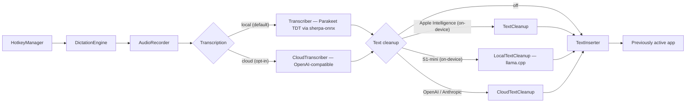
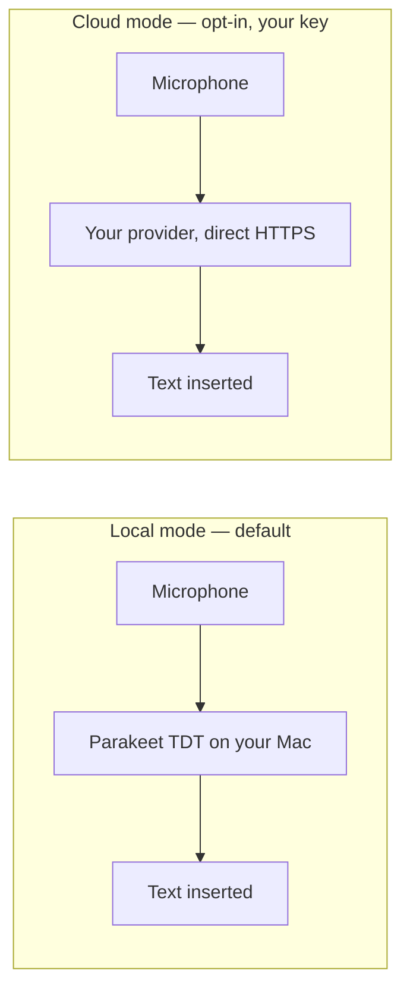

<p align="center">
  
</p>

<h1 align="center">Hold To Talk</h1>

<p align="center">Free, open-source voice dictation for Apple Silicon Macs. Hold a key, speak, release — your words appear wherever your cursor is. Local by default, with optional cloud using your own key.</p>

<p align="center">
  <a href="https://github.com/Edamame-Labs/hold-to-talk/releases/latest"></a>
  
  
  <a href="LICENSE"></a>
</p>

<p align="center">
  <a href="https://holdtotalk.ai/demo.mp4">
    
  </a>
</p>

<p align="center">
  <a href="https://holdtotalk.ai/">Website</a>
  ·
  <a href="https://holdtotalk.ai/demo.mp4">Watch the demo video</a>
  ·
  <a href="https://github.com/Edamame-Labs/hold-to-talk/releases/latest">Download</a>
</p>

- **Free and open-source** — no subscription, no paywall. Inspect the code, build it yourself, or install a signed release.
- **Apple Silicon required** — built around local speech recognition with [sherpa-onnx](https://github.com/k2-fsa/sherpa-onnx) + [NVIDIA Parakeet TDT 0.6B](https://huggingface.co/nvidia/parakeet-tdt-0.6b-v2), and local cleanup with [llama.cpp](https://github.com/ggml-org/llama.cpp) + [Superwhisper S1-mini](https://huggingface.co/superwhisper/s1-mini).
- **Local by default** — no accounts, no tracking. Audio stays on your Mac unless you choose cloud transcription with your own key.
- **Bring your own key** — supported Macs can use an OpenAI-compatible API key instead of the local model. Your key, your account, direct to the provider — Hold to Talk never sees your data.
- **Fast** — optimized for low-latency dictation with an int8-quantized on-device speech model, or cloud models when you want peak accuracy.
- **Works everywhere** — dictate into any app: Slack, Notes, your IDE, email, browser.
- **Text cleanup** (optional) — fix grammar, punctuation, and filler words on-device with [S1-mini by Superwhisper](https://huggingface.co/superwhisper/s1-mini) (any Apple Silicon Mac, English only) or Apple Intelligence (macOS 26+), or in the cloud with OpenAI or Anthropic using your own API key. Set Dictation Language to Multilingual and the English-only model is hidden.
- **Auto-updates** — direct downloads update in-app via [Sparkle](https://sparkle-project.org).
- **Stays close at hand** — opens as a normal Mac app and keeps a menu bar status control. Hold a key to record, release to paste.

## For teams

Push configuration fleet-wide via MDM managed preferences, pre-approve permissions with standard PPPC profiles, and route cloud traffic through your own proxy or Azure OpenAI with per-user SSO — or run fully on-device for air-gapped environments. See the [Enterprise Deployment Guide](docs/enterprise/README.md).

## Install

**Requirements:** macOS 15+ and Apple Silicon.

### Download

Grab the latest notarized `DMG` or `ZIP` from [GitHub Releases](https://github.com/Edamame-Labs/hold-to-talk/releases), install into `/Applications`, and open.

### Homebrew

```bash
brew install edamame-labs/tap/holdtotalk
```

### First launch

On first launch, Hold to Talk guides you through:

1. Granting **Microphone** and **Accessibility** permissions
2. Downloading the Parakeet TDT speech model, or connecting your own API key as a fallback
3. Choosing your hotkey

### Build from source

Requires Xcode command line tools.

```bash
git clone https://github.com/Edamame-Labs/hold-to-talk.git
cd hold-to-talk
make build          # downloads sherpa-onnx, builds release, assembles .app
make install        # copies to /Applications
make run            # debug build + run

make test-reset     # full uninstall + reset all state + reset permissions
```

## Usage

1. Launch — appears in the Dock and as a menu bar mic icon
2. Hold **Fn** (default) to record
3. Release to transcribe and insert into the active window
4. Use the app window or menu bar icon for status and settings

### Settings

<p align="center">
  
</p>

| Setting | Default | Options |
|---|---|---|
| Hotkey | Fn | Fn, Control, Option, Command, Shift, F13-F19, Option+Space, Control+Space, Command+Shift+Space |
| Transcription profile | Balanced | Fast, Balanced, Best |
| Transcription provider | On-Device | On-Device, OpenAI (your key) |
| Dictation language | English | English, Multilingual — decides which cleanup providers are offered |
| Text cleanup | On (if available) | On/Off — S1-mini (on-device), Apple Intelligence, OpenAI, or Anthropic (your key) |
| Cleanup writing style | Semi-formal | Casual, Semi-casual, Semi-formal, Formal (S1-mini only) |
| Cleanup formatting | Prose | Prose, Allow lists (S1-mini only) |
| Cleanup prompt | (default) | Customizable instructions (Apple Intelligence and cloud providers) |
| Launch at Login | Off | On/Off |
| Diagnostic logging | Off | On/Off — local only, transcript text redacted |

## Architecture



```
HoldToTalkApp       SwiftUI app with Dock presence and menu bar status control
DictationEngine     Orchestrator: record -> transcribe -> cleanup -> insert
AudioRecorder       AVAudioEngine mic capture, resamples to 16 kHz mono
Transcriber         sherpa-onnx offline recognizer + Silero VAD segmentation
CloudTranscriber    Optional OpenAI-compatible cloud transcription (your API key)
TextCleanup         Optional on-device cleanup via Apple Intelligence (macOS 26+)
LocalTextCleanup    Optional on-device cleanup via S1-mini on llama.cpp (any Apple Silicon)
CloudTextCleanup    Optional cloud cleanup via OpenAI or Anthropic (your API key)
TextInserter        CGEvent unicode insertion or clipboard paste (per-app strategy)
HotkeyManager       Global hold shortcuts, no explicit Input Monitoring request
ModelManager        Parakeet TDT model download and lifecycle
CleanupModelManager S1-mini cleanup model download and lifecycle
RecordingHUD        Floating overlay with live waveform during recording
OnboardingView      Guided setup: permissions, model download, hotkey test
SettingsView        SwiftUI settings form
```

Dependencies: [sherpa-onnx](https://github.com/k2-fsa/sherpa-onnx) (speech recognition), [Sparkle](https://sparkle-project.org) (auto-updates, excluded from App Store builds). Cloud features use the OpenAI and Anthropic APIs directly with user-provided keys.

### Why Parakeet TDT + sherpa-onnx

**[NVIDIA Parakeet TDT 0.6B](https://huggingface.co/nvidia/parakeet-tdt-0.6b-v2)** uses a Token-and-Duration Transducer architecture instead of the encoder-decoder attention approach used by Whisper. Key advantages for real-time dictation:

- **Linear latency** — TDT predicts tokens frame-by-frame without an autoregressive decoding loop, so transcription time scales linearly with audio length rather than quadratically.
- **Silence-robust** — emits blanks for non-speech frames instead of hallucinating text, a common problem with Whisper on silence or noise.
- **Compact** — int8-quantized to ~640 MB on disk (vs ~1.5 GB for Whisper Large-v3) while matching or exceeding its English accuracy.
- **Greedy search is sufficient** — no beam search needed for high-quality output, reducing CPU cost.

**[sherpa-onnx](https://github.com/k2-fsa/sherpa-onnx)** provides the inference runtime as a single C library with Swift interop:

- Mel spectrogram extraction matched to Parakeet's training configuration (128-dim log-mel features)
- TDT transducer decoding with blank penalty and optional modified beam search for hotword boosting
- Bundled [Silero VAD](https://github.com/snakers4/silero-vad) for speech segmentation, preventing transducer looping on long audio
- Multi-threaded CPU inference with configurable thread counts

This combination lets the app focus on UX (hotkey management, text insertion, recording HUD) while sherpa-onnx handles the entire audio-to-text pipeline locally.

## Permissions

macOS will prompt for:
- **Microphone** — recording audio
- **Accessibility** (Keyboard Access) — inserting text into apps
- **No explicit Input Monitoring request** — regular shortcuts are registered with macOS; modifier-only shortcuts use Accessibility-trusted modifier-state events.

## Notes

- Secure text fields (password inputs) are intentionally blocked.
- Some browser and Electron targets use temporary clipboard paste for reliable insertion. Hold to Talk restores the previous clipboard when the paste completes and leaves the clipboard untouched if another app changes it during that window, but other local clipboard managers may still observe the transient dictated text.
- Direct downloads support in-app updates via Sparkle. App Store builds use App Store distribution.

## Contributing

Contributions welcome. Please open an issue to discuss larger changes before submitting a PR.

## Privacy



There are no Hold To Talk servers in either path.

Transcription runs on your Apple Silicon Mac by default — no accounts, no tracking. If you opt in to cloud transcription or cleanup, audio or text is sent directly to the provider (OpenAI or Anthropic) using your own API key. Hold to Talk never proxies, stores, or has access to your data. API keys are stored in the macOS Keychain for this Mac only. Diagnostic logs are off by default, local only, and redact transcript text. See [Privacy Policy](PRIVACY.md).

## License

[Apache 2.0](LICENSE)
